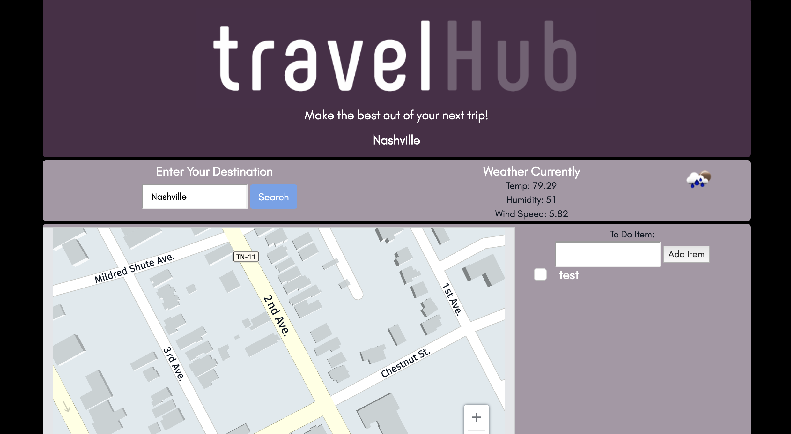
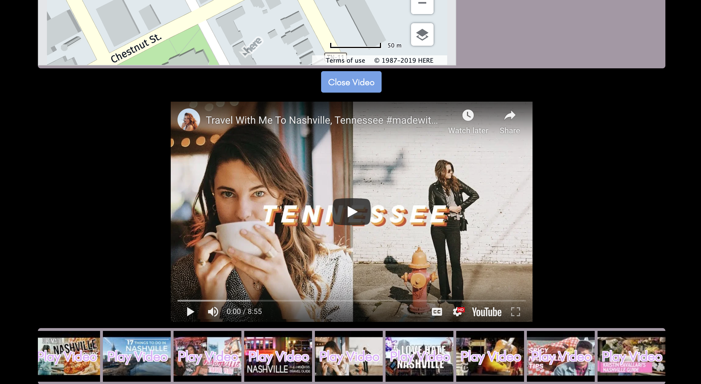

# TravelHub Project
Single Page app that gives tools for Travel, Videos,Maps,Weather and a ToDo List

# Link 
https://jonfinley211.github.io/Project1/

## Original Inspiration
This site provides initial information for users who are planning to travel somewhere new. A to-do list is provided with local storage in order to store ideas and inspiration.

## Technology Used
- jQuery 
- 3 APIs (Here, OpenWeather, YouTube)
- animate.css library
- Bootstrap
- JSON requests

## First Half of Screen

## Second Half of Screen When 

## Install Instructions
- Clone Repository
- Obtain a OpenWeather Api Key
- Obtain a Youtube Api Key
- Obtain a Here Maps Key
- Open in browser 

## Install Intructions 
-Clone Repot
Sign up for firebase
Sign up for open Weather api
Sign up for youtube api
Sign up for here maps
npm install
open in browser
have fun send me what you have done:)

## Future Goals
- Making a more interactive list with Google links
- Making the map more interactive 
- Additional travel APIs (SkyScanner, Booking, etc.)
